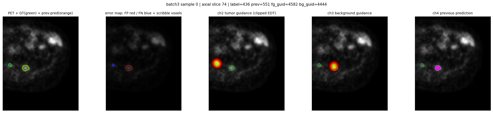
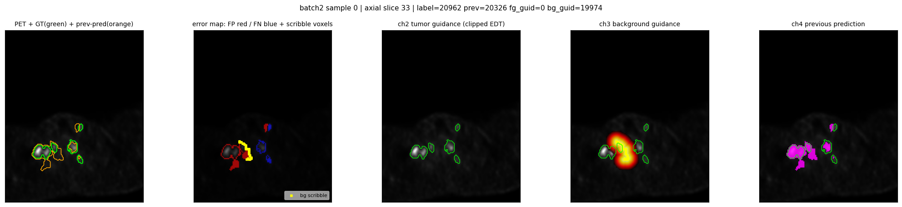
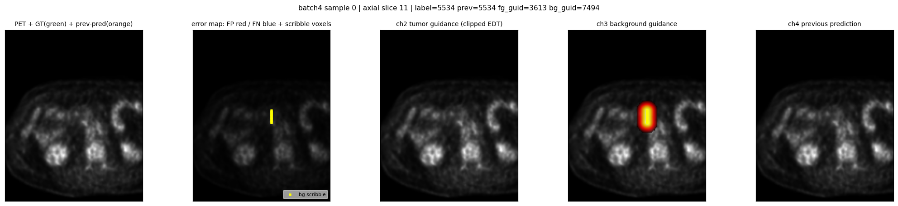
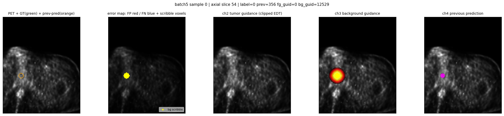

# Interactive fine-tuning pipeline

Turns the organizers' 4-channel `Dataset998` nnU-Net baseline into a 5-channel **interactive** model
trained with online, error-driven scribble simulation. Everything lives in `src/train/` and plugs into
stock `nnUNetv2_train` — no fork of nnU-Net, no changes to the preprocessed store.

| file | what it does |
|---|---|
| `guidance.py` | clipped-EDT encoding `max(0, 1 − d/R)` of a scribble point set |
| `scribble_sim.py` | safe wrapper around the **official** simulator + the error-driven iteration protocol at patch level |
| `corrupt.py` | ground-truth label → plausible "previous prediction" |
| `interaction_transform.py` | the batchgenerators-v2 transform that writes channels 2–4 |
| `nnUNetTrainer_Interactive.py` | the trainer (`-tr nnUNetTrainer_Interactive`) |
| `init_from_baseline.py` | 4 → 5 input-channel weight surgery |
| `make_plans.py` | writes `nnUNetPlans_interactive.json` + the 5-channel `dataset.json` |
| `make_synthetic_dataset.py` | tiny fake preprocessed dataset for end-to-end tests |
| `bench_transform.py` | per-sample cost and correctness checks of the simulation |
| `viz.py` | sanity-check figures straight out of the real dataloader |
| `networks.py` | the B13/B14 network classes and the weight surgery onto them |
| `networks_eva.py` | the B17 network class: a trainable 2.5D EVA-02-B branch fused into the encoder |
| `nnUNetTrainer_InteractiveB17.py` | the B17 trainer: layer-wise-lr-decay param groups and a per-group PolyLR |
| `test_networks_eva.py` | the B17 launch gate (shapes, epoch-0 equivalence, parameters, speed, VRAM) |
| `nnUNetTrainer_InteractiveArch.py` | the B13/B14/C0 trainers and the epoch-0 identity gate |
| `make_arch_plans.py` | writes the variant plans (`nnUNetPlans_b13/b14.json`) |
| `test_networks.py` | shapes, epoch-0 equivalence, parameter counts, speed and VRAM |
| `networks_re.py` | the RE network: LesionTracer's ResEncL at 5 channels, plus the PET remap |
| `make_re_plans.py` | writes `nnUNetPlans_re.json` (our plans, their architecture) |
| `init_from_lesiontracer.py` | 2 -> 5 input-channel surgery onto the ResEncL |
| `nnUNetTrainer_InteractiveRE.py` | the RE trainer and its bit-exact launch gate |
| `test_networks_re.py` | the RE launch gate, including the `pet_renorm` measurement |

## Model input

| ch | content | normalization | source |
|---|---|---|---|
| 0 | CT | `CTNormalization` | preprocessed store |
| 1 | PET (SUV) | `ZScoreNormalization` | preprocessed store |
| 2 | tumor guidance | `NoNormalization` | generated on the fly |
| 3 | background guidance | `NoNormalization` | generated on the fly |
| 4 | previous prediction (0/1) | `NoNormalization` | generated on the fly |

Two deliberate departures from the baseline:

* **Encoding.** The baseline writes σ = 0 "heatmaps" — a handful of isolated binary voxels — and then
  *z-scores* them, turning each scribble voxel into a ≈2500σ spike whose magnitude depends on the image
  size and on how many scribbles have accumulated. We use a clipped Euclidean distance transform,
  `e(x) = max(0, 1 − d(x)/R)` with `R = 10` voxels, and mark channels 2–4 `noNorm`, so the value the
  network sees is exactly the value we wrote, bounded in [0, 1] and spatially supported.
* **Previous-prediction channel.** The baseline has no memory of its own output, which is the structural
  reason it cannot refine iteratively. Channel 4 is RITM-style mask guidance.

The store keeps 4 channels (CT, PET and two all-zero placeholders, so it stays compatible with the
baseline preprocessing). The transform keeps only the first two and writes its own channels 2–4, so it
works unchanged against a 2-channel or a 4-channel store. `KeepFirstChannelsTransform` drops the
placeholders at the *front* of the pipeline so `SpatialTransform` never spends a cubic-spline resampling
pass on them.

`make_plans.py` derives `nnUNetPlans_interactive.json` from the baseline `plans.json`, changing only
`normalization_schemes`, `use_mask_for_norm` and the placeholder
`foreground_intensity_properties_per_channel` entries for channels 2–4. Spacing, patch size, batch size
and the whole PlainConvUNet architecture are untouched — that is what makes the weight surgery valid — and
`data_identifier` keeps pointing at the store, because the guidance never touches disk. Note that nnU-Net
resolves `normalization_schemes` entries as *class names*, so the plans file must say `NoNormalization`,
while `noNorm` is the `dataset.json` channel-name spelling that maps to the same class; `make_plans.py`
writes each spelling in its own file.

## How the guidance channels are produced

Per training patch, inside the dataloader worker:

1. **Sample the scribble count** `k ~ Categorical([.28, .22, .18, .14, .10, .08])` over `k ∈ {0..5}` — the
   evaluator runs 6 iterations, so 5 is the maximum a case can accumulate. The heavy mass on small `k` is
   deliberate: a model trained on dense guidance only can score 0 Dice at 0 clicks, and half of our
   AUC-Dice on lesion-free cases is the `k = 0` state.
2. **Invent a previous prediction `P`** by corrupting the label `L` (`corrupt.py`): per 3D component, one
   of keep / dilate / erode / drop / shift; then with p ≈ 0.5 paste 1–3 hallucinated blobs at high-PET
   voxels outside `L` (p = 0.8 on a lesion-free patch, the most valuable state to train, since a single
   false-positive voxel zeroes a lesion-free case's Dice for the whole run). Additionally `P = ∅` with
   p = 0.20 and `P = L` with p = 0.10. The `P = ∅` share is kept at ≥ 0.2 because the container has no
   previous prediction at iteration 0; with the `k = 0` coupling, channel 4 is all-zero for ≈40 % of
   patches.
3. **Run the official protocol** `k` times (`scribble_sim.py`): `overseg = P & ¬L`, `underseg = ¬P & L`;
   call the official `simulate_scribble_from_label` on each with a strategy drawn from
   {centerline, random, boundary}; apply the official selection rule; append the chosen stroke and
   **erase the 3D error component it landed on**, so the next iteration targets the next-largest error
   exactly as the evaluation loop does across container calls.
4. **Perturb** ≈20 % of strokes ScribblePrompt-style (random breaking into pieces plus a smooth in-plane
   warp), as insurance for the clinician-scribble category where real strokes are longer and sloppier.
5. **Stamp** the clipped EDT of the tumor list into channel 2 and of the background list into channel 3,
   and write `P` into channel 4.

**Independent ("already satisfied") scribbles, p = 0.25.** The category-2 clinician scribbles were
collected against the *baseline* model's errors and are replayed unchanged to ours, so many will already
be satisfied by our prediction. With p = 0.25 the scribbles are therefore derived from an independently
sampled corruption `P′` while channel 4 still carries `P`, which forces the network to treat a scribble as
a **constraint to maintain**, not only as a change signal.

### Two things that are easy to get wrong

**Axis convention.** `simulate_scribble_from_label` iterates `for z in range(label_array.shape[2])` — it
expects the axial slice axis to be the **last** array axis. In the nnU-Net preprocessed array the axes are
`(axial, y, x)`, so feeding a patch in directly draws the "axial" stroke on a *sagittal* plane.
`scribble_sim.py` moves the slice axis to the end before every official call and maps the coordinates
back; `slice_axis` is a parameter, default 0. With the fix every stroke occupies exactly one axis-0 slice
(0 of 145 stroke groups spanned more than one in the benchmark runs); without it, strokes spanned up to 13.

**The 2-tuple quirk.** `simulate_scribble_from_label` returns `(coords, label_cls, size)` normally but
`([], False)` — two values — on an empty mask, which is why the official `interactive_loop.py` raises
whenever an error mask is empty. `simulate_scribble()` handles both arities and returns `([], 0)`.

### Where the transform sits, and why

```
KeepFirstChannelsTransform(2)      <- position 0
SpatialTransform, Gaussian noise/blur, brightness, contrast,
low-res, gamma x2, Mirror, RemoveLabelTansform(-1, 0)
InteractionSimulationTransform     <- here
DownsampleSegForDSTransform
```

The guidance must live on **exactly the grid of the label used in the loss**, and generating it after all
spatial transforms makes that true by construction. Generating it earlier and letting the channels be
warped along as extra image channels was rejected because `SpatialTransform` resamples image channels with
a cubic spline, which puts ringing and fractional boundaries into what should be a crisp binary
previous-prediction mask; the pre-spatial patch is also 30–80 % larger, so the simulation would cost
proportionally more. Placing it before `DownsampleSegForDSTransform` is mandatory: that transform replaces
`segmentation` with a list of tensors. The guidance channels consequently receive no intensity
augmentation, which is correct — they are not images.

## Weight surgery

`init_from_baseline.py` expands the first convolution from `(32, 4, 3, 3, 3)` to `(32, 5, 3, 3, 3)`:
channels 0–3 are copied from the baseline (2 and 3 scaled by `guidance_scale`) and channel 4 is zero. The
tensor appears **four** times in the state dict — `encoder.stages.0.0.convs.0.conv.weight`,
`…convs.0.all_modules.0.weight`, and both again under `decoder.encoder.…` because the decoder holds a
reference to the encoder — and all four must be patched, or `load_pretrained_weights` aborts on a shape
mismatch. Optimizer and grad-scaler state are dropped and `current_epoch` is reset, so the output is a
valid `-pretrained_weights` source.

`guidance_scale` defaults to **1.0**. Rescaling to reproduce the baseline's *peak* activation would be
wrong: matching a ≈2500-magnitude single-voxel spike needs a ×2500 factor, which would make the first
layer's guidance response ~500× its CT/PET response and destroy the pretrained InstanceNorm statistics on
the first step. The right reference is the image channels, which have unit scale after normalisation: the
RMS response to PET is `‖w_{c,1}‖₂`, and for a guidance channel saturated at 1 over the kernel support it
is `‖w_{c,2}‖₂`. The baseline's per-channel weight RMS values are 0.230 / 0.384 / 0.207 / 0.235, already
comparable, so scale 1.0 is activation-matched. `--guidance-init kaiming` and `--guidance-scale` A/B it.

## Trainer

`nnUNetTrainer_Interactive` subclasses `nnUNetTrainer`. Every parameter below is overridable through the
corresponding environment variable, and the epoch count also through the `_50epochs` / `_100epochs` /
`_150epochs` / `_250epochs` trainer variants, which record the choice in the results folder name.

| | value | environment override |
|---|---|---|
| epochs | 200 | `nnUNet_interactive_epochs` |
| initial LR | 1e-3 (fine-tune; the baseline used 1e-2) | `nnUNet_interactive_lr` |
| optimizer | SGD, momentum 0.99 nesterov, wd 3e-5, PolyLR (nnU-Net default) | |
| loss | DC+CE with Dice smoothing term 0 | `nnUNet_interactive_noSmooth` |
| scribble count | `k ∈ {0..5}`, `[.28,.22,.18,.14,.10,.08]` | `nnUNet_interactive_k_probs` |
| EDT radius / slice axis | 10 voxels / 0 | `nnUNet_interactive_radius`, `..._slice_axis` |
| stroke perturbation / independent scribbles | 0.2 / 0.25 | `nnUNet_interactive_p_perturb`, `..._p_independent` |
| pretrained weights | — | `nnUNet_interactive_pretrained`, or `-pretrained_weights` |

`smooth=0` cannot produce a NaN here: with `batch_dice=True` the denominator of
`MemoryEfficientSoftDiceLoss` is a sum over the whole batch of softmax outputs and is never exactly 0.
`perform_actual_validation` is skipped by default (`nnUNet_interactive_skip_final_val=0` forces nnU-Net's
version): it runs sliding-window inference over the *stored* preprocessed cases, which do not carry
channels 2–4. The real number is the 6-iteration AUC from `src/interactive_eval.py`. Validation *during*
training uses the same interaction transform, so the reported pseudo-Dice is a noisy interactive proxy.
On resume (`--c`), `plans["continue_training"]` is read before `nnUNetTrainer.__init__` pops it, and
`nnUNet_interactive_pretrained` is then ignored so the checkpoint on disk wins.

## Metric-aligned loss terms (`nnUNetTrainer_InteractiveV2`)

`nnUNetTrainer_InteractiveV2` adds two optional terms to the compound loss. Both default to weight
0, so the class with no environment variables set is the same loss as `nnUNetTrainer_InteractiveB6`;
the named subclasses `…V2_negfp`, `…V2_blob` and `…V2_both` switch them on and give each variant its
own results folder. Both terms are evaluated on the **full-resolution** head only — the deep
supervision pyramid keeps the unmodified DC+CE.

### A — lesion-free patch penalty (`LesionFreeFPLoss`)

The challenge scores a lesion-free case 1.0 for an empty prediction and 0.0 for *any* false
positive, and excludes it from the lesion-level F1 altogether. A false positive on such a case is
therefore the most expensive single error available — and it is the error the configured loss is
blind to. With `batch_dice=True` and `smooth=0` (the baseline's setting and ours), a batch in which
no sample contains a label voxel has `sum_gt = 0`, so

```
dc = (2·0 + 0) / (0 + sum_pred + 0).clamp_min(1e-8)      = 0
```

and its gradient with respect to the logits is **identically zero**; the only remaining signal is
cross entropy averaged over ~2.3·10⁶ easy background voxels. `test_v2_loss.py` asserts this
(`|∇|₁ = 0.000e+00`). The term restores a gradient for that state as the soft false-positive volume
of an empty patch,

```
L_A = s / (s + c),        s = Σ p_fg over the patch,   c in voxels (default 50 ≈ 0.6 mL)
```

which is `1 − Dice(prediction, ∅)` with the smoothing constant reinstated. It is bounded in [0, 1),
its gradient is largest exactly where the metric's step is (`s → 0`) and it is self-limiting there
because `∂p/∂logit → 0` as `p → 0`. Measured on a near-empty patch carrying a 50-voxel false
positive — the realistic state of a fine-tuned model on a lesion-free case — it delivers **48×** the
gradient L1 norm of DC+CE; at 400 false-positive voxels, 1.4×. In the opposite, grossly-wrong regime
it saturates by design and DC+CE takes over. `all_patches=True` extends it to the label-free part of
patches that do contain lesions; off by default, because there the pooled Dice already sees them.

### B — instance-wise (blob) Dice (`InstanceDiceLoss`)

DMM is component-count F1 at IoU ≥ 0.1, and in the validation set 42 % of the ground-truth lesions
are smaller than 1 mL while carrying 1–2 % of the lesion volume. A volume-overlap loss is almost
indifferent to them; the metric counts each one. Following blob loss (Kofler et al., *blob loss:
instance imbalance aware loss functions for semantic segmentation*, IPMI 2023; reference
implementation MIT-licensed), the Dice is computed **once per connected component** with every
*other* component masked out of the prediction, and averaged over components, so a 0.2 mL lesion and
a 200 mL lesion contribute equally.

The reference implementation loops over instances with full-size tensors. Here the identical
quantity comes from two scatter reductions over the instance-id map: with `x` the foreground
probability, `Iᵢ` the i-th component and `T = Σ x` over the patch,

```
interᵢ    = Σ_{Iᵢ} x
pred_sumᵢ = T − (Σⱼ interⱼ − interᵢ)          ← the other blobs, masked out
diceᵢ     = (2·interᵢ + s) / (pred_sumᵢ + |Iᵢ| + s)
L_B       = 1 − mean_i diceᵢ
```

so the cost is independent of the number of lesions — which matters, since a single case in this
dataset carries 191. `test_v2_loss.py` checks the vectorised form against a literal masked loop to
1e-4. Components are 18-connected, matching the metric. `smooth` defaults to 1.0 voxel: unlike the
pooled Dice, which we deliberately run at `smooth=0`, a per-instance Dice over a 5-voxel lesion is
unusable without one. Samples with an empty label contribute nothing (that state is term A's job),
which is also the reference behaviour.

Illustration from the tests: a patch with one 1728-voxel lesion predicted perfectly and one 8-voxel
lesion missed entirely scores pooled Dice **0.9977** and instance-Dice loss **0.4444**.

### Knobs

| | class attribute | environment variable | default |
|---|---|---|---|
| lesion-free weight | `W_LESION_FREE` | `nnUNet_v2_lesionfree_weight` | 0 |
| its `c`, voxels | `LESION_FREE_SMOOTH_VOXELS` | `nnUNet_v2_lesionfree_smooth_vox` | 50 |
| apply to non-empty patches too | `LESION_FREE_ALL_PATCHES` | `nnUNet_v2_lesionfree_all_patches` | false |
| instance-Dice weight | `W_BLOB` | `nnUNet_v2_blob_weight` | 0 |
| its smoothing term | `BLOB_SMOOTH` | `nnUNet_v2_blob_smooth` | 1.0 |
| connectivity | `BLOB_CONNECTIVITY` | `nnUNet_v2_blob_connectivity` | 18 |
| average over the k smallest components only (0 = all) | `BLOB_SMALLEST_K` | `nnUNet_v2_blob_smallest_k` | 0 |
| ignore components below this size | `BLOB_MIN_VOXELS` | `nnUNet_v2_blob_min_voxels` | 1 |

`InteractiveV2Loss.last_terms` carries the three scalars (`base`, `lesion_free`, `blob`) of the last
forward pass, for logging.

### Cost

Measured at the plans patch size `(2, 2, 112, 160, 128)`, forward + backward of the term alone, on an
NVIDIA L4 that was not idle — so these are upper bounds: **term A 10.5 ms**, **term B 108 ms**
(on CPU at `nice 19` on the A100 host: 33 ms and 66 ms, which brackets the term-B overhead at roughly
2× term A rather than 10×). Term B breaks down as
one `cc3d` pass (4.3 ms per sample at 18-connectivity), one device→host copy of the label
(1.6 ms per sample) and the two scatter reductions plus their backward (~24 ms per sample). Only the
foreground voxels' linear indices cross the bus, not the full id map, and the two-class foreground
probability is written `sigmoid(l₁ − l₀)` rather than materialising a `(b, C, …)` float32 softmax —
37 MB instead of 150 MB per call. Against the measured 236 ms per optimizer step of the batch-2
configuration, term B is therefore worth budgeting for (~+25 s on a 59 s epoch) and term A is free.

`python -m train.test_v2_loss [--cuda]` runs the whole check list: finiteness and range on random,
empty and perfect patches; gradient flow; the zero-gradient pathology above; equality with the
reference blob-loss loop; size invariance; drop-in behaviour over a deep-supervision output list;
and the timings. `make_synthetic_dataset.py` plus a 2-epoch `nnUNetv2_train` run exercises all four
trainer variants end to end.

## Running it

nnU-Net ≥ 2.8 has an external trainer search path, so no site-packages surgery is needed:

```bash
export nnUNet_raw=... nnUNet_preprocessed=... nnUNet_results=...
export nnUNet_extTrainer=$PWD/src/train
export PYTHONPATH=$PWD/src:$PYTHONPATH
export AUTOPETV_REPO=/path/to/autoPETV      # for the official scribble simulator

# once: interactive plans + 5-channel dataset.json, and the 4 -> 5 channel surgery
python -m train.make_plans --out-dir $nnUNet_preprocessed/Dataset998_AutoPETV \
    --baseline-plans $nnUNet_preprocessed/Dataset998_AutoPETV/nnUNetPlans.json \
    --baseline-dataset-json $nnUNet_preprocessed/Dataset998_AutoPETV/dataset.json \
    --data-identifier nnUNetPlans_3d_fullres --dataset-name Dataset998_AutoPETV --num-training 1611
python -m train.init_from_baseline \
    --src <baseline>/fold_0/checkpoint_final.pth --dst weights/interactive_init_5ch.pth

export nnUNet_interactive_pretrained=$PWD/weights/interactive_init_5ch.pth
nnUNetv2_train Dataset998_AutoPETV 3d_fullres 0 \
    -tr nnUNetTrainer_Interactive -p nnUNetPlans_interactive
```

`recursive_find_trainer_class_by_name` imports every module in `nnUNet_extTrainer`, so all of
`src/train/*.py` must be import-safe — every script's work is behind `if __name__ == "__main__"`.

Write the interactive plans into a preprocessed root that is *separate* from the store: nothing may be
added inside `nnUNetPlans_3d_fullres/`, because `infer_dataset_class` asserts a single file extension in
there, and the store must keep its own 4-channel `dataset.json`. An evaluator pointed at a trained model
folder needs `plans.json`, `dataset.json` and `dataset_fingerprint.json` next to `fold_0/`, plus
`nnUNet_extTrainer` on the environment, because the checkpoint records
`trainer_name = nnUNetTrainer_Interactive` and nnU-Net has to import it.

## B6 continuation

`nnUNetTrainer_InteractiveB6` continues the fine-tune above with the interaction distribution re-fitted to
the measured deficit of the first run, which is **prompt-gated**: a large share of the lesion-bearing cases
scores Dice 0 at iteration 0 and only recovers once scribbles arrive. Two knobs of the interaction
distribution change, plus the schedule the continuation runs on.

| | `nnUNetTrainer_Interactive` | `nnUNetTrainer_InteractiveB6` |
|---|---|---|
| `K_PROBS` over `k ∈ {0..5}` | `[.28, .22, .18, .14, .10, .08]` | `[.36, .24, .16, .11, .08, .05]` |
| `P_INDEPENDENT_SCRIBBLES` | 0.25 | 0.35 |
| epochs / initial LR | 200 / 1e-3 | 120 / 5e-4 |

`k = 0` and `k = 1` *are* iterations 0 and 1 of the evaluation loop, which carry trapezoid weights 0.5 and
1.0, so they get more of the gradient budget; `k = 5` keeps a non-zero share so the many-scribble regime is
still trained. The independent ("already satisfied") share rises because the category-2 clinician scribbles
were collected against a different model, so a growing fraction of them is already satisfied by our own
prediction and has to be read as a constraint to maintain. Radius, slice axis, stroke perturbation,
corruption model, loss, batch size and `save_every = 5` are inherited unchanged, so the two runs differ in
exactly these knobs.

It is a **continuation, not a `--c` resume**: the weights are loaded from the first run's
`checkpoint_final.pth` through `nnUNet_interactive_pretrained`, while the optimizer, the grad scaler and the
PolyLR schedule start fresh at epoch 0 over 120 epochs. The class overrides `initialize()` to load that
checkpoint with `load_state_dict(..., strict=True)` instead of nnU-Net's `load_pretrained_weights`, which
skips every key containing `.seg_layers.` — correct when adapting a *foreign* pretraining whose output layer
predicts different classes, and wrong here, where re-initialising the segmentation heads would throw away
the calibration of the very model being continued. The architecture is identical, so the exact load is safe;
a mismatch falls back to nnU-Net's loader. The separate trainer class gives it its own results
folder, `Dataset998_AutoPETV/nnUNetTrainer_InteractiveB6__nnUNetPlans_interactive__3d_fullres`, so the first
run stays reproducible, the checkpoint mirror keeps the two models apart, and both can be evaluated side by
side. An evaluator needs `nnUNet_extTrainer` pointing at `src/train` as before — the checkpoint now records
`trainer_name = nnUNetTrainer_InteractiveB6`, which is defined in the same module as the base trainer.

`scripts/env/train_b6.sh` is the launcher. It refuses to start while another trainer or an inference job holds
the GPU (`--wait` polls every 5 min instead), verifies the staged store file-by-file count and the source
checkpoint's 5-channel first convolution, and bakes the environment into a generated launcher script,
because a new `tmux` session inherits the environment of the tmux *server* rather than of the caller. It
also unsets `nnUNet_interactive_k_probs`, `..._p_independent`, `..._epochs` and `..._lr`, so a stale export
cannot silently override the values the class defines.

```bash
JOBS=2 bash scripts/env/train_resume.sh --stage-only   # once per runtime: local copy of the store
bash scripts/env/train_b6.sh --wait                    # launch as soon as the GPU is free
```

`JOBS` is the parallelism of the staging copy and defaults to 4. Against a **cold** FUSE content cache, 4
concurrent readers of a 4833-file directory are enough to wedge the mount daemon: it pins a core, stops
answering, and every access to the mount — including unrelated jobs' — blocks in uninterruptible sleep.
Use `JOBS=2` for the first staging of a fresh runtime; 4 is only safe once the cache is warm.

Resume after a runtime loss — restage the store, then resume from the last checkpoint of the B6 folder
(`--resume` pulls `checkpoint_latest.pth` back from the mirror when the local folder is empty, never
`checkpoint_final.pth`, which `--c` would prefer over it):

```bash
bash scripts/env/train_resume.sh --stage-only
bash scripts/env/train_b6.sh --resume
```

### Running other trainers of the same family, and queueing them

`TRAINER=<class> TAG=<short-name>` selects any other trainer that subclasses
`nnUNetTrainer_InteractiveB6`. `TAG` names the log (`train_$TAG.log`), the progress file
(`progress_$TAG.txt`) and both tmux sessions (`train_$TAG`, `${TAG}progress`), so runs never collide; the
results folder and the checkpoint-mirror folder follow the trainer class name automatically, and the
progress watcher is handed `MODEL_NAME=<TRAINER>__nnUNetPlans_interactive__3d_fullres`, from which it
derives the mirror path. The source weights (`INIT`) are shared across the family — every one of these runs
continues from the same first-fine-tune `checkpoint_final.pth`.

`ALLOW_BUSY_GPU=1` starts while another job holds the GPU. That is a deliberate choice, not a default: this
training is dataloader-bound (~45 % GPU, 8.2 GiB of 80), so it coexists with an inference job, but both get
slower and the two contend for CPU rather than for VRAM. Pair it with `NICE=5` so the other job keeps CPU
priority. Measured cost of co-residency with a sliding-window inference job on the same box: **66.5 s/epoch
against 59.3 s solo, ≈ +12 %**.

```bash
ALLOW_BUSY_GPU=1 NICE=5 TAG=b10 TRAINER=nnUNetTrainer_InteractiveV2_negfp bash scripts/env/train_b6.sh
```

Only one training may run at a time on one GPU; the launcher enforces that (it refuses while an
`nnUNetv2_train 998` process exists). To chain runs, poll the previous `train_$TAG` session and launch the
next when it is gone — waiting for the *process* as well as the session, because the tmux session can
disappear a moment before the process group does.

Each run's progress watcher is started by the launcher; run it by hand like this:

```bash
MODEL_NAME=nnUNetTrainer_InteractiveB6__nnUNetPlans_interactive__3d_fullres \
PROGRESS_FILE=<work>/progress_b6.txt TOTAL_EPOCHS=120 python3 -u scripts/env/progress_watch.py
```

At the measured 59 s/epoch plus the one-off `torch.compile`, 120 epochs is ≈2 h alone, ≈2 h 15 min
alongside an inference job.

## Cost

A100-SXM4-80GB (12 vCPU), torch 2.11 + cu128, nnU-Net 2.8.1, `torch.compile` on, patch 112×160×128, 250
training + 50 validation iterations per epoch, fold 0 (1288 train / 323 val).

| batch | epoch 0 (compile) | steady epoch | per sample | peak VRAM | mean GPU util |
|---|---:|---:|---:|---:|---:|
| 2 | 104.3 s | **59.3 s** | 0.119 s | 8.2 GiB | 43 % |
| 4 | 166.9 s | 123.6 s | 0.124 s | 19.2 GiB | 45 % |

Doubling the batch doubles the epoch time exactly and leaves per-sample cost and GPU utilization
unchanged: the run is **dataloader-bound**, not GPU-bound. Use batch 2 — it matches the batch size the
baseline checkpoint was trained at and gives twice as many optimizer steps per hour. 200 epochs is ≈3.3 h.
The bottleneck is nnU-Net's own CPU augmentation, not our transform: the interaction simulation costs
99 ms mean / 53 ms median / 249 ms p90 per patch (`bench_transform.py`) against a per-sample budget of
~1.19 s. `KeepFirstChannelsTransform` is what keeps it there — without it `SpatialTransform` would
spline-resample the two all-zero placeholder channels.

The preprocessed store must be on **local disk**. Read randomly, one blosc2 chunk per patch, it is the
worst possible access pattern for a network filesystem; over a FUSE-mounted cloud drive epoch 0 did not
finish in 13.5 minutes at 0.5 % GPU utilization, against 104 s and 43 % from local disk.

## Checks

`bench_transform.py` measures containment on 40 real patches per configuration (fold 0). In the
error-driven setting every tumor stroke voxel lies inside the label and on a false-negative region and
every background stroke voxel outside it and on a false-positive region. With `--p-independent 1` the
strokes stay correct as absolute annotations but about half the tumor strokes and all the background
strokes are already satisfied by channel 4 — the category-2 regime. In the production setting stroke
perturbation moves 6 % of tumor stroke voxels off the label, which is the intended realism. No stroke in
any of the runs spanned more than one axial slice.

End to end, `nnUNetv2_train` runs the trainer on a synthetic blosc2 store (`make_synthetic_dataset.py`),
loads the surgered checkpoint, trains, resumes with `--c` and writes all three checkpoints. On the real
store every batch is `(2, 5, 112, 160, 128)` with channels 2–3 in [0, 1] and channel 4 in {0, 1}, and
validation pseudo-Dice is 0.73–0.76 from the first epochs — the weight surgery preserves the baseline's
competence rather than restarting from it.

## Figures

Real preprocessed patches straight out of the training dataloader (`viz.py`).


*Tumor scribble on a missed lesion: the previous prediction (magenta) misses the left lesion (blue = FN)
and over-segments the right one (red = FP).*


*More FP than FN voxels, so the official rule places a background scribble (yellow) on the largest
false-positive component.*


*Category-2 state: the previous prediction is already correct, yet a background scribble arrives.*


*Negative-case state: no lesion in the patch, one hallucinated component on physiological uptake.*

## Architecture variants

Two continuations of the B10 checkpoint (`nnUNetTrainer_InteractiveV2_negfp`) that change the
**network** and nothing else: same store, same interaction distribution, same loss, same 120-epoch
schedule at lr 5e-4. nnU-Net builds the network from `configurations.<cfg>.architecture` —
`network_class_name` resolved with `pydoc.locate`, `arch_kwargs` handed to the constructor — so a
variant is a plans file plus a class, not a fork of the trainer.

| | class | plans | trainer | added parameters |
|---|---|---|---|---|
| B13 | `train.networks.GlobalContextUNet` | `nnUNetPlans_b13` | `nnUNetTrainer_InteractiveB13` | **+0.48 M (+1.6 %)** |
| B13b | same class, rotary code retuned | `nnUNetPlans_b13b` | `nnUNetTrainer_InteractiveB13b` | +0.48 M (identical) |
| B14 | `train.networks.EditBranchUNet` | `nnUNetPlans_b14` | `nnUNetTrainer_InteractiveB14` | **+0.28 M (+0.9 %)** |
| B17 | `train.networks_eva.EVAFusionUNet` | `nnUNetPlans_b17` | `nnUNetTrainer_InteractiveB17` | **+86.84 M (+282 %)** |
| C0 | `PlainConvUNet` (unchanged) | `nnUNetPlans_interactive` | `nnUNetTrainer_InteractiveC0` | 0 |

C0 is the control: the same continuation with no architectural change, so a variant's delta measures
the block rather than the extra epochs.

`train.networks` resolves because `src` is on `PYTHONPATH` both on the training box and inside the
container (`PYTHONPATH=/opt/algorithm:/opt/algorithm/src`, `src/` is copied into the image), and the
trainer writes its `plans.json` next to `fold_0/`, so the predictor rebuilds the same class from the
model folder with no extra wiring.

### B13 — global-context bottleneck

A residual transformer block on the **deepest** encoder feature map. At the plans patch the
bottleneck is `7×5×4 = 140` tokens of 320 features (the last stage's stride is `[1, 2, 2]`, not
`[2, 2, 2]`), so whole-patch context costs a few hundred microseconds. The rationale is the pair of
decisions a purely convolutional receptive field cannot make locally: physiological uptake versus
lesion, and "this patch contains nothing".

The block follows EVA-02 (arXiv:2303.11331) in the parts that matter here: pre-norm layers, a **SwiGLU**
feed-forward of hidden width `2/3 · 4d` with **sub-LN** on its hidden activations before the last
projection, and **3D rotary position embeddings** on the queries and keys instead of a learned positional
table, so the block carries no size-dependent parameter and transfers to any patch shape. A second
`LayerNorm` on the attention output is kept for symmetry; EVA-02-B/L deliberately drop that one, and it is
512 parameters either way. The `n_head_dim/2` rotation pairs are split across the three axes, and each axis rotates by its
own voxel coordinate. The stack runs at a reduced width (`context_dim = 128` against 320 features)
behind a 1×1 convolution, which is what keeps it under half a million parameters; a second 1×1
convolution projects back and is **zero-initialised**, making the whole block an exact identity at
initialisation while still receiving a non-zero gradient on the first step.

**The rotary code has to be tuned to a 7x5x4 grid.** With `context_dim = 128` over 8 heads the head
dimension is 16, so there are 8 rotation pairs to spread over three axes — 3/3/2 bands — and a single
base `theta = 10000` puts their wavelengths at 6.3, 135 and 2917 voxels on an axis 7 voxels long: one
band oscillates roughly per voxel and the other two are all but constant across the whole grid, which
is close to no position code at all. **B13b** keeps the block and its parameter count exactly and
changes two numbers: 4 heads, so the head dimension is 32 and each axis gets 5-6 bands, and one theta
per axis equal to that axis's extent (`context_rope_theta = [7, 5, 4]`, written by
`make_arch_plans --context-rope-theta grid`), which lands the wavelengths at 6.3-31.8 voxels. What that
buys is the *phase* each band sweeps across the axis: on the 7-voxel z axis, 6.00 / 4.34 / 3.14 / 2.27 /
1.64 / 1.19 rad, against 6.00 / 0.28 / 0.013 rad under a single `theta = 10000`, where two of the three
bands are constant over the whole grid. Every band stays within one cycle across the axis, so there is no
sub-2-voxel resolving power; the ladder that would reach `lambda in [2, 2L]` is
`omega_i = pi * L^(-i/(n-1))`.

`context_type = "mamba"` swaps in a bidirectional selective state-space block (two `mamba_ssm` scans
over the forward and reversed token sequence, shared zero-initialised output projection) where
`mamba_ssm` is installed. It is not part of the shipped configuration.

### B14 — edit branch

The interaction currently enters only at the input, five convolutions away from the deepest features
and 32 upsamplings away from the output. B14 keeps the pretrained encoder and decoder as the
*automatic* branch and adds a second, lightweight decoder branch (16–32 features per stage) that sees
the guidance at **every** scale. At each decoder stage it concatenates its own upsampled state, a 1×1
projection of the encoder skip, and the three interaction channels max-pooled to that stage's grid,
then emits an **edit logit** that is added to the automatic logit. Deep supervision is applied to the
sum only; the branch is never supervised on its own.

Max pooling rather than averaging carries the guidance down: a scribble is a thin structure whose
*presence* must survive a 32× downsampling, and the clipped-EDT encoding is non-negative, so the
maximum over a pooling window is the value at the stroke.

The five edit segmentation heads are zero-initialised, so the fused logits are the automatic logits at
initialisation.

### Weight surgery and the epoch-0 gate

`networks.graft_state_dict` loads the source checkpoint into the variant with `strict=False` and then
raises unless **every** source tensor was consumed with a matching shape; the trainer additionally
requires that the tensors left at their initialisation are exactly those under the variant's declared
prefixes (`context.` for B13, `edit_*` for B14, none for C0). nnU-Net calls
`network.apply(network.initialize)` after construction, which would re-initialise the zeroed
convolutions with Kaiming; both classes override `initialize` to skip modules tagged during
construction.

That makes "epoch 0 is B10" checkable rather than assumed. `nnUNet_arch_refbatch` points at a file
holding one fixed input batch and stock B10's deep-supervision outputs for it (written by
`test_networks.py --emit-ref`); the trainer runs the grafted network on it at startup and aborts
unless the maximum absolute logit difference is below 1e-5. Measured on the real checkpoint at the
plans patch and batch, both variants reproduce B10 **exactly** (max |diff| `0.000e+00` at every deep
supervision scale, deep supervision on and off).

```bash
python -m train.make_arch_plans --base-plans $PREP/$DS/nnUNetPlans_interactive.json \
    --variant b13 --out $PREP/$DS/nnUNetPlans_b13.json
python -m train.test_networks --plans $PREP/$DS/nnUNetPlans_interactive.json \
    --checkpoint <B10 checkpoint_final.pth> \
    --emit-ref <work>/b10_ref_batch.pt --cuda --bench

nnUNet_arch_refbatch=<work>/b10_ref_batch.pt INIT=<B10 checkpoint_final.pth> \
TAG=b13 TRAINER=nnUNetTrainer_InteractiveB13 PLANS=nnUNetPlans_b13 \
    bash scripts/env/train_b6.sh
```

`train_b6.sh` gained `PLANS=` (a variant plans file) and `ALLOW_CONCURRENT_TRAIN=1` (a second trainer
on the same GPU; pair it with `NICE` and a reduced `nnUNet_n_proc_DA`, because the runs contend for
CPU, not for VRAM).

### Cost of the two blocks

Forward + backward at the plans configuration (batch 2, patch 112×160×128, fp16 autocast, A100-80GB),
`test_networks.py --bench`:

| network | parameters | ms / optimizer step | peak VRAM | GPU share of a 250-step epoch |
|---|---:|---:|---:|---:|
| B10 (`PlainConvUNet`) | 30.79 M | 125.1 | 5.18 GiB | 31.3 s |
| B13 | 31.27 M | 130.8 | 5.18 GiB | 32.7 s |
| B14 | 31.07 M | 186.1 | 5.93 GiB | 46.5 s |

Against the measured 59.3 s steady-state epoch of the batch-2 configuration — which is
**dataloader-bound**, not GPU-bound — B13 is free and B14 costs at most the 15 s of GPU time it adds.

### B17 -- a trainable 2.5D EVA-02-B encoder fused into the U-Net

B13 and B14 add capacity; B17 adds **pretraining**. It keeps the whole B10 network as
is and runs a second, ImageNet-22k/1k-pretrained view of the same patch alongside it:
every axial slice is rendered into three channels, pushed through EVA-02-B, and the
resulting tokens are folded back into the 3D encoder as a volume of tokens.

**Geometry.** The plans patch is `112 x 160 x 128` at `3 x 2.04 x 2.04` mm, and the
preprocessed axis order is `(axial, y, x)`, so an axial slice is the `160 x 128`
in-plane grid = 326 x 261 mm of body. It is squash-resized to **224 x 182** px, which
is that aspect ratio to 1.4 % and a whole number of 14-px patches in both directions:
**16 x 13 = 208** tokens per slice, plus one prefix token. timm's
`dynamic_img_size=True` resamples the absolute position table and rebuilds the 2D RoPE
for that grid, so no weight is tied to the 448-px 32 x 32 grid the checkpoint was
trained at. The 112 slices of a batch of 2 go through as **one 224-image EVA batch**;
the tokens come back as a volume `(B, 768, 112, 16, 13)`.

**Fusion, and the resize that would have thrown most of it away.** The token volume is
fused into encoder **stage 3**, `(256, 14, 20, 16)`. The reduction is done in two steps
and the order matters:

```python
t = F.adaptive_avg_pool3d(t, (14, 16, 13))          # z: area average over all 112
t = F.interpolate(t, size=(14, 20, 16), mode="trilinear")   # in-plane only
skips[3] = skips[3] + self.eva_fuse[0](t)           # zero-init 1x1x1, no bias
```

`F.interpolate(..., "trilinear")` is an 8-neighbour blend, not an area average: taking
z from 112 straight to 14 samples only the two planes nearest each output centre, so
**14 of 112 slices** would have any influence and the branch would run EVA forward
*and backward* on 112 slices to use 14. Pooling z first makes every slice contribute;
`test_networks_eva.py` asserts `112/112`. Reducing before projecting is also what keeps
the projection cheap -- 768 -> 256 at the stage's own grid rather than at the full
token grid.

The projection is zero-initialised and carries **no bias**: a zero-init bias still
trains, and a learned constant per channel is not EVA information -- it would confound
the row's delta with a plain learned offset.

**Rendering, and the one approximation in it.** The three channels are the ones
`eva02_features.py` established: CT in a soft-tissue window `[-160, 240]` HU, PET as
`log1p(SUV)/log1p(60)`, and the same log-SUV through a +/-4-slice (+/-12 mm)
maximum-intensity slab, so a 2D backbone can see out of plane. All three are computed
on the GPU inside `forward`, and normalised with the **OpenAI-CLIP** mean/std that this
checkpoint was trained with (read from timm's `pretrained_cfg`, not ImageNet's).

CT inverts exactly, because `CTNormalization` uses the global fingerprint constants.
**PET does not**: the store z-scores it per case, and a training patch carries no
per-case correction, so the inverse uses the cohort medians of `pet_norm_correction`
(`mu` 0.109, `sd` 0.625; the per-case `sd` spans 0.44-1.14). The PET channel is
therefore a fixed monotone function of the z-score rather than of true SUV. That is
acceptable precisely because the *same* function is applied at training and at
inference and the backbone is trained through it -- but it is an approximation, and it
is part of why the branch has to be trainable rather than frozen.

**What trains, and at what rate.** `patch_embed` and the first four blocks are frozen
and run inside `torch.no_grad()`; the rendering is a function of the network input, not
of any parameter, so nothing downstream needs a gradient through them, and skipping the
graph there is what makes a 224-slice EVA batch fit. The remaining eight blocks are
gradient-checkpointed.

The optimizer is the one place B17 cannot simply inherit B10's recipe. nnU-Net's
default is `SGD(lr=5e-4, momentum=0.99, nesterov, wd=3e-5)` over the whole network.
Momentum 0.99 amplifies the steady-state step by `1/(1-m) = 100x` -- an effective ~5e-2
against ViT weights whose std is ~0.02 -- and it decays every LayerNorm gain and bias,
where EVA-02's own recipe gives them none. Making the *whole* network AdamW would fix
the ViT and confound the row against the SGD-trained C0 control. So `_DualOptimizer`
presents one `torch.optim.Optimizer` face over two real optimizers with disjoint
parameters:

| | parameters | optimizer |
|---|---:|---|
| U-Net + fusion projection | 30.99 M | `SGD(lr 5e-4, momentum 0.99, nesterov, wd 3e-5)` -- **identical to C0** |
| EVA blocks 4-11 + final norm | 56.74 M | `AdamW(base lr 5e-5, betas (0.9, 0.98), eps 1e-6, wd 0.05, none on 1-D)` |
| EVA stem + blocks 0-3 | 29.61 M | frozen, never handed to an optimizer |

with **layer-wise lr decay 0.7** over the AdamW groups (5e-5 at the final norm down to
2.9e-6 at block 4). nnU-Net's `PolyLRScheduler` writes one lr into *every* group and
would erase that ladder at epoch 0, so each group carries an `lr_scale` and
`GroupScaledPolyLRScheduler` decays them together while keeping the ratios.

`torch.compile` is disabled for this network (`_do_i_compile`): the branch mixes a
`no_grad` prefix, gradient checkpointing and a `forward` that dispatches on
`self.training`, and dynamo either graph-breaks through all of it or recompiles per
shape.

**Epoch 0 is B10, exactly**, and the branch demonstrably trains. The zero-init
projection makes the fused logits the baseline logits, and the same strict graft plus
`nnUNet_arch_refbatch` gate as B13/B14 asserts it: `max |logit diff| 0.000e+00` against
a freshly built `PlainConvUNet` under the same weights, deep supervision on and off.
The arch trainer's per-epoch diagnostic then shows the branch is not merely present but
moving -- after one epoch, `|grad| = 7.5e-1` and `|w-w0|/|w0| = 0.0039` over the added
tensors, against B13's interior, which never left its initialisation.

**Pretrained weights never ship as a download.** The plans write
`eva_pretrained: false`, so constructing the class -- which the predictor does, from the
shipped `plans.json`, inside a container started with `--network=none` -- builds the
backbone randomly and touches no network. The trainer sets `AUTOPET_EVA_PRETRAINED=1`
for the duration of its own `initialize()`, so the timm weights are fetched exactly
once, at weight-surgery time, before the arch trainer snapshots the added parameters;
from then on they travel in our own checkpoint (`network_weights` contains all 86.35 M
EVA tensors -- verified).

**Cost.** `test_networks_eva.py --bench`, batch 2 at the plans patch, fp16 autocast,
A100-80GB, **sharing the GPU with other trainings and evaluations** (both rows are
inflated; B10 benches at 125.1 ms on an idle box):

| network | parameters | ms / optimizer step | peak VRAM |
|---|---|---:|---:|
| B10 (`PlainConvUNet`) | 30.79 M | 328.3 | 5.62 GiB |
| B17 (`EVAFusionUNet`) | **117.33 M** (86.35 M EVA, 56.74 M of it trainable; 0.20 M fusion) | 871.3 | 6.90 GiB |

Measured steady epoch: **174 s** with one evaluation co-resident, **~300-380 s** on a box
also running two other trainings, against B10's 59 s (80 epochs ~= 7-8 h there). The branch turns a
dataloader-bound run into a GPU-bound one; it is the one variant here whose cost is not
free. `eva_z_stride` (2 or 8) halves or eighths the slice count if a slot demands it --
the fused stage only has 14 z-bins to fill.

**Container.** The trained checkpoint carries the full 86.35 M EVA tensors (~1.05 GB
per checkpoint including optimizer state), so evaluation needs no download -- but the
class is still built with `timm`, so **`timm==1.0.22` is now in
`requirements-submission.txt`** and the image must contain it. Belt and braces for the
network-less container: set `ENV HF_HUB_OFFLINE=1` and `ENV AUTOPET_EVA_PRETRAINED=0`
in the `Dockerfile`. The weights are MIT (BAAI-Vision `EVA/LICENSE`; the timm mirror is
tagged `license: mit`).

```bash
python -m train.make_arch_plans --base-plans $PREP/$DS/nnUNetPlans_interactive.json \
    --variant b17 --out $PREP/$DS/nnUNetPlans_b17.json
python -m train.test_networks_eva --plans $PREP/$DS/nnUNetPlans_interactive.json \
    --checkpoint <B10 checkpoint_final.pth> --cuda --bench

nnUNet_arch_refbatch=<work>/b10_ref_batch.pt INIT=<B10 checkpoint_final.pth> \
TAG=b17 TRAINER=nnUNetTrainer_InteractiveB17_80epochs PLANS=nnUNetPlans_b17 EPOCHS=80 \
ALLOW_CONCURRENT_TRAIN=1 NICE=5 bash scripts/env/train_b6.sh
```

### B18 -- the same branch, conditioned on the interaction

B17's fusion is a function of channels 0 and 1 only. `render_eva_channels` reads the CT
and the PET, so the token volume added to the stage-3 skip is **bit-identical at all six
interaction iterations**: whatever the user points at, the branch contributes the same
map. The 39-case screen of the epoch-40 snapshot measures exactly the deficit that
predicts. Paired against the `C0` control, per interaction iteration:

| iteration | 0 | 1 | 2 | 3 | 4 | 5 |
|---|---:|---:|---:|---:|---:|---:|
| C0 Dice | 0.623 | 0.799 | 0.831 | 0.849 | 0.867 | 0.874 |
| B17 Dice | 0.621 | 0.794 | 0.819 | 0.832 | 0.853 | 0.862 |
| delta | **-0.002** | -0.005 | -0.012 | **-0.017** | -0.014 | -0.012 |

At iteration 0 the interaction channels are zero and the two networks agree to within
noise; the deficit appears only once the user starts talking, and it is six times larger
by iteration 3. A scribble-blind term added to the skip the decoder refines from behaves
as an anchor -- the more the interaction says, the more the fixed prior costs.

`EVAInteractiveFusionUNet` changes one block: **what the ViT is given**. A new
`eva_interact_embed`, a zero-initialised `Conv2d(3, 768, 14, stride=14)` with no bias,
patchifies the three interaction channels on the same 14 px grid as `patch_embed`, and
its tokens are added to the patch tokens before the positional embedding. The branch
becomes a conditional encoder, and it buys the one thing no convolution at stage 3 can:
EVA's self-attention is global over the slice, so one click can propagate to the other
lesions in the same slab.

Three details make it work.

**The slab.** `render_eva_interaction` spreads the guidance and previous-mask channels
over a `+/-4`-slice maximum along z, exactly as the PET channel's slab MIP. A scribble is
a handful of voxels on one or two axial slices; without the slab it would reach 2 of the
112 slice-images and then be averaged away by the `adaptive_avg_pool3d` that reduces z
from 112 to the fused stage's 14 -- a 1/56 dilution. With it the click is visible across
the 27 mm neighbourhood it lies in, which is the scale a 20 mm token can carry.

**The frozen prefix now runs in the graph.** `patch_embed` stays frozen and stays under
`no_grad`: it is pretrained and unchanged. But the gradient of `eva_interact_embed` has
to reach it through the blocks, so blocks 0-3 can no longer run under `no_grad`. Their
parameters remain frozen -- no optimizer state, no weight gradients -- and only their
activations join the graph, gradient-checkpointed like the other eight. Measured cost
below; it is smaller than the B17 delta over B10.

**A rate for the zero-init path, set by measurement.** Both new modules start at zero and
`dL/dtokens = eva_fuse^T dL/dskip`, so `eva_interact_embed` sees no gradient at all until
`eva_fuse` has left zero -- the trap that cost B13 its run. The rate on those two modules
is therefore a real choice. The first B18 launch derived it from the poly-lr integral
(`int_0^20 (1-t/20)^0.9 dt = 10.5` against the `int_0^40 (1-t/80)^0.9 dt = 30.8` the B17
epoch-40 snapshot received) and used 3.0. That derivation assumed B17's fusion was weak.
Measured on real store patches, it is not:

| model | `eva_fuse` norm | fused residual rms / stage-3 skip rms | share of the residual that moves when a scribble is added |
|---|---:|---:|---:|
| B17 `checkpoint_final` (80 epochs, x1) | 1.92 | **1.52** | 0.000 (the branch never reads channels 2-4) |
| B18 at x3, `checkpoint_ep10` (10 epochs) | 3.84 | **7.12** | **0.043** |

B17's branch does not perturb the stage-3 skip, it **dominates** it -- and at x3 the
residual reached seven times the skip in a tenth of the epochs, 96 % of it still
scribble-blind. That run was stopped rather than screened.
`nnUNetTrainer_InteractiveB18.FUSION_LR_MULT = 1.0` is B17's own rate, and the same
numbers put a 20-epoch run at `eva_fuse` ~1.8 against B17's 1.92, so B18 and B17 differ in
exactly one thing. It is the same SGD, the same weight decay, one `lr_scale`, applied to
the 0.65 M zero-init parameters only, and it is printed in the training log. Any future
row in this lineage should report the residual/skip ratio next to its screen number.

Everything else is B17's: the same graft, the same dual optimizer (stock SGD over the
U-Net exactly as `C0`, AdamW with the EVA-02 layer-decay ladder over the ViT) under
`GroupScaledPolyLRScheduler`, the same `eva_pretrained: false` in the plans so the
predictor never reaches the hub, the same stage-3 fusion.

**Launch gate** (`train.test_networks_eva --variant b18`, A100-80GB, plans patch
`112x160x128`, batch 2), all measured, none estimated:

| check | result |
|---|---|
| pretrained weights survive `apply(initialize)` | max abs diff vs timm `0.000e+00` |
| graft | 292 source tensors consumed, 236 new, all under `eva.` / `eva_fuse.` / `eva_interact_embed.` |
| interaction embedding inert at init | `max abs d(tokens)` for one click `0.000e+00` |
| interaction embedding connected when perturbed | `max abs d(tokens)` for one click `1.842e+01` |
| token volume | `(2, 768, 112, 16, 13)` |
| z-slices reaching the fusion | 112 / 112 |
| epoch-0 identity, deep supervision on | max abs logit diff `0.000e+00` |
| epoch-0 identity, deep supervision off | max abs logit diff `0.000e+00` |
| checkpoint round-trip, `strict=True` | 471 MB, max abs logit diff `0.000e+00` |
| parameters | 117.79 M (86.35 M EVA, 56.74 M trainable; 0.648 M zero-init fusion) |
| forward + backward | **568.8 ms/step, 7.49 GiB peak** (B10 on the same idle box: 126.7 ms, 5.62 GiB) |

```bash
python -m train.make_arch_plans --base-plans $PREP/$DS/nnUNetPlans_interactive.json \
    --variant b18 --out $PREP/$DS/nnUNetPlans_b18.json
python -m train.test_networks_eva --variant b18 --round-trip \
    --plans $PREP/$DS/nnUNetPlans_interactive.json \
    --checkpoint <B10 checkpoint_final.pth> --cuda --bench --bench-baseline

nnUNet_arch_refbatch=<work>/b10_ref_batch.pt INIT=<B10 checkpoint_final.pth> \
TAG=b18 TRAINER=nnUNetTrainer_InteractiveB18_20epochs PLANS=nnUNetPlans_b18 EPOCHS=20 \
ALLOW_CONCURRENT_TRAIN=1 NICE=5 bash scripts/env/train_b6.sh
# note: train_b6.sh bakes a fixed set of variables into the tmux launcher, so
# nnUNet_b18_fusion_lr_mult set in the environment is NOT forwarded -- change the class
# default, or add the variable to the launcher template.
```

**Result: rejected.** The epoch-10 snapshot scores AUC-Dice 3.8789 / AUC-DMM 3.4207 on
the 39-case screening subset against the `C0` control's 4.0940 / 3.6323 -- paired
`dDice -0.2152 +/- 0.1497`, `dDMM -0.2117 +/- 0.1949`, gate FAIL on both, four times
worse than B17. Per-iteration Dice 0.599 / 0.761 / 0.791 / 0.802 / 0.815 / 0.820.

The interaction conditioning did engage -- the share of the fused residual that moves
when a scribble is added is 5.6 % at epoch 5, 6.8 % at epoch 10 and 9.9 % at epoch 20,
against B17's exact zero -- and it bought nothing. B18 is worse at **iteration 0**, where
the interaction channels are zero and the new embedding contributes exactly nothing, so
the conditioning cannot be what caused the loss; and the gap still widens monotonically
with interactions, exactly as B17's did.

Together with the frozen-feature probe that preceded B17 (EVA features on top of the
network's own: hot-token tumour-vs-physiology AUC 0.9811 -> 0.9725) this closes the
EVA-02 line. The branch sees the *same patch* the U-Net sees, at 20 mm tokens against
stage 3's 16 mm cells, in 2D: it carries no information the network does not already
have, and at 1.52x the rms of the skip it is added to it displaces one the decoder needs.

## Sampling and gating variants (S1, N1)

Two more continuations of the B10 checkpoint against the same `C0` control. Neither touches the store,
the interaction distribution, the loss weights of B10, the predictor or the submission contract.

| | what changes | files | plans | trainer | added parameters |
|---|---|---|---|---|---|
| S1 | **which patch** a forced-foreground draw is centred on | `s1_sampler.py` | `nnUNetPlans_interactive` | `nnUNetTrainer_InteractiveS1` | **0** |
| N1 | a coarse learned presence prior added to the foreground logit | `networks_n1.py`, `make_n1_plans.py` | `nnUNetPlans_n1` | `nnUNetTrainer_InteractiveN1` | **+257 (+0.0008 %)** |

### S1 — component-balanced foreground sampling

`nnUNetDataLoader.get_bbox(force_fg=True)` picks a foreground **voxel** uniformly from
`properties['class_locations']`, so a lesion is chosen with probability proportional to its *volume*.
At the measured lesion-size distribution that is a 500 : 1 bias against a 0.2 mL lesion versus a 100 mL
one, and only ~0.2 % of training patches end up centred on a sub-1-mL FDG lesion. S1 replaces that draw
with

```
component c with probability  p(c) ∝ |c| ** S1_GAMMA      # gamma 0 = uniform over components
voxel uniformly inside c                                  # gamma 1 = stock nnU-Net
```

`S1_GAMMA` defaults to **0.0**. The foreground/background ratio (`oversample_foreground_percent`, 0.33)
is untouched, background patches go through the stock code path, and a lesion-free case falls back to it
as well.

The per-case component table (`cc3d`, 18-connected, matching the challenge metric) is built lazily on
first use from the stored `_seg.b2nd`, keeping the true voxel count per component plus up to 256 voxels
sampled uniformly inside it, and is cached in memory and on disk under
`<preprocessed>/<Dataset>/s1_components/` — deliberately a *sibling* of `nnUNetPlans_3d_fullres/`,
which the launcher verifies byte-for-byte against Drive and into which nothing may be written. The
first epoch pays the labelling (~365 s against a ~90 s steady state); afterwards the workers read the
cache.

nnU-Net's dataloader calls `self._data.load_case(i)` and then `self.get_bbox(...)` without passing the
identifier or the label, so the sampler would have no way to know which case it is placing a patch in.
`S1RecordingDatasetBlosc2` / `…Numpy` record both on the dataset instance the loader already holds;
they are module-level classes, not built with `type()`, so a dataloader that has to be pickled to a
worker still works. `get_dataloaders` is overridden (rather than the class monkey-patched) because the
training and the validation loader are built in one call and **only the training one is rebalanced** —
validation keeps nnU-Net's sampler so its curve stays comparable with the other rows.

`test_s1_sampler.py` is the before/after, drawn through the real code path on real cases:

```bash
python -m train.test_s1_sampler --preprocessed $PREP/$DS --cases 3 --draws 3000 --min-components 6
```

| bucket | <0.25 mL | 0.25–0.5 | 0.5–1 | 1–3 | 3–10 | >10 |
|---|---:|---:|---:|---:|---:|---:|
| stock (volume-proportional) | 0.1 % | 0.1 % | 0.8 % | 4.0 % | 17.3 % | 77.8 % |
| S1, γ = 0 | 36.2 % | 0.9 % | 9.4 % | 19.7 % | 21.8 % | 12.0 % |

Pooled over three multi-lesion cases: patches built around a sub-1-mL lesion **0.94 % → 46.5 %**, mean
volume of the chosen lesion **234 mL → 26 mL**, and the S1 row reproduces the case's own
component-count histogram, which is what "uniform over components" means.

### N1 — presence-prior gate

`train.networks_n1.PresenceGateUNet` is the interactive `PlainConvUNet` plus a single `Conv3d(C, 1, 1)`
on **encoder stage 3**. Its output is a coarse per-cell log-odds map of "is there a lesion in this
region", trilinearly upsampled and **added to the foreground logit** of the final output and of every
deep-supervision output at its own scale.

Stage 3, not the bottleneck: for the 112×160×128 plans patch the stage-3 map is 14×20×16, one cell =
8×8×8 voxels = **6.37 mL**, while a bottleneck cell is 16×32×32 voxels = 204 mL and cannot resolve the
0.5–3 mL false-positive components the gate is meant to suppress.

Both the weight and the bias are zero at initialisation, so the added log-odds is exactly 0 and epoch 0
reproduces B10 bit for bit, while the convolution still has a non-zero gradient on the first step.
nnU-Net calls `network.apply(network.initialize)` after construction; `initialize` is overridden to skip
the tagged module so the zeros survive.

With deep supervision on, `forward` returns `[seg_0 … seg_n, gate]` — the coarse map is appended
**after** the segmentation outputs. `DeepSupervisionWrapper` zips outputs against targets and therefore
ignores it, `validation_step` still reads `output[0]`, and `PresenceGateAuxLoss` strips it off the end.
With deep supervision off — the inference path — the return value is the single fused logit tensor,
exactly the stock contract, so the predictor, the post-processing config and `submission/process.py` are
untouched.

The auxiliary term is `BCEWithLogits(gate, max_pool3d(label))` at weight `N1_AUX_W = 0.5`. Its second
job is a gradient: on a label-empty patch the configured Dice+CE has exactly zero Dice gradient
(`test_v2_loss.py`) and about half of all training patches are label-empty, so the BCE is the only
*localised* signal that state produces.

`pos_weight` is measured, not guessed. `train.measure_n1_prior` draws patches through the real
dataloader at the configured oversampling and max-pools the label onto the gate grid:

```
positive cells 7711 / 716800 = 1.076 %     label-empty patches 44.4 %
N1_AUX_POS_WEIGHT = (1 - p) / p = 91.96
```

which is the value that makes the positive and the negative half of the BCE contribute equally. The
value actually used is logged at startup.

### The epoch-0 gate, in process

The file-based version of the "epoch 0 is B10" assertion — cache one forward pass of stock B10 to disk,
assert `< 1e-5` against it in the trainer — does not survive contact with cuDNN. `run_training` sets
`cudnn.benchmark = True`, so the convolution algorithm is autotuned per process against the free VRAM at
that moment. Measured on this box, the **zero-change control C0** failed the 1e-5 assertion against a
cached reference at **8.7e-3** on logits whose magnitude is 23 (4e-4 relative); forcing
`cudnn.deterministic` in the emitting process moves the same forward pass by 9.5e-3. The file-based gate
is a float-noise detector, not an architecture check.

`identity_gate.SourceIdentityGateMixin` removes the noise instead of tolerating it: it rebuilds the
*source* network from `nnUNetPlans_interactive.json` **inside the training process**, loads the same
checkpoint into it, and compares the two forward passes there. Identical convolutions of identical shape
then get the identical autotuned algorithm. Both rows score exactly `0.000e+00`:

```
[gate] identity assertion PASS: max |logit diff| 0.000e+00 < 1e-05 on (1, 5, 112, 160, 128),
       in-process against b10_final.pth built from nnUNetPlans_interactive.json
```

The strict-graft half of the gate is unchanged and still comes from `nnUNetTrainer_InteractiveArch`:
every source tensor must be consumed with a matching shape, and the tensors left at their
initialisation must be exactly those under the row's declared prefixes (`presence_gate.` for N1, none
for S1).

### Running them

```bash
python -m train.make_n1_plans --base-plans $PREP/$DS/nnUNetPlans_interactive.json \
    --out $PREP/$DS/nnUNetPlans_n1.json
python -m train.measure_n1_prior --preprocessed $PREP/$DS --batches 80   # -> N1_AUX_POS_WEIGHT

INIT=<B10 checkpoint_final.pth> TAG=s1 TRAINER=nnUNetTrainer_InteractiveS1 S1_GAMMA=0.0 \
    ALLOW_BUSY_GPU=1 ALLOW_CONCURRENT_TRAIN=1 NICE=5 bash scripts/env/train_b6.sh

INIT=<B10 checkpoint_final.pth> TAG=n1 TRAINER=nnUNetTrainer_InteractiveN1 PLANS=nnUNetPlans_n1 \
    N1_AUX_W=0.5 N1_AUX_POS_WEIGHT=91.96 \
    ALLOW_BUSY_GPU=1 ALLOW_CONCURRENT_TRAIN=1 NICE=5 bash scripts/env/train_b6.sh
```

`train_b6.sh` passes `S1_*` and `N1_*` through to the generated launcher, as it already did for
`nnUNet_arch_refbatch` and `nnUNet_n_proc_DA`.

### Cost

S1 adds one `np.random.choice` over a few hundred components per patch (**≈ 0 s/epoch** in steady
state) plus the one-off `cc3d` pass, and **exactly 0** at inference. N1 adds a 1×1×1 convolution on a
14×20×16 map, one max-pool and one BCE; the +257 parameters are 0.0008 % of the network and the extra
work is below the noise of a dataloader-bound epoch.

### Stacked variants (round two)

`nnUNetTrainer_InteractiveStacked.py` combines the sampler with an architecture block by multiple
inheritance, so nothing is re-implemented: the sampler, the auxiliary loss, the weight surgery and the
in-process identity gate are the same code that produced the single-mechanism rows.

| class | plans | mechanism | new tensors |
|---|---|---|---|
| `nnUNetTrainer_InteractiveS1N1` | `nnUNetPlans_n1` | S1 sampler + N1 presence head | 2 |
| `nnUNetTrainer_InteractiveS1B14` | `nnUNetPlans_b14` | S1 sampler + `EditBranchUNet` | 112 |

The one thing each class must declare is `NEW_PARAM_PREFIXES`: `nnUNetTrainer_InteractiveS1` sets it to
`()` and would otherwise shadow the architecture row's prefixes through the MRO. Verified at epoch 0
against the B10 tensors: both graft with no stray and no unexpected key and reproduce the source logits
at `0.000e+00`.

`EpochOverrideMixin` reads `NUM_EPOCHS` from the environment (passed through by `train_b6.sh`, which
unsets the `nnUNet_interactive_*` overrides on purpose). The poly LR schedule is computed from
`self.num_epochs`, so a 40-epoch screen decays the learning rate over 40 epochs rather than truncating a
120-epoch schedule. `..._screen40` subclasses pin the same thing to a results folder of their own.

### Screening subset

`docs/valset_screen39.txt` is the 39-case screening list, derived from the `B10g9_nostate_fixed_sub39`
case list: index blocks 0–23 and 63–77 of `valset_v1.txt`, each starting on a multiple of three with a
length divisible by three. That alignment matters — `assign_strategies` round-robins
centerline/random/boundary over the *sorted* case list, so only an aligned subset gives every case the
same scribble strategy it has in the full run (verified 39/39 against the recorded strategies). A
paired Δ against the control on these 39 cases is therefore meaningful; an arbitrary 39 would not be.

`scripts/eval_screen.sh` runs one model over a case list or the whole set. It exists next to
`eval_variant.sh` because case names contain spaces: the list has to reach `interactive_eval.py` as a
bash array of `--cases` arguments, and **`interactive_eval.py` has no `--cases_file` option** —
`eval_variant.sh`'s `CASES_FILE` branch passes a flag that does not exist and aborts the run.

## ResEncL warm start (RE)

Every row above changes the method on top of the organisers' 30.79 M `PlainConvUNet`. RE changes the
**backbone and its pretraining**, and keeps the method fixed: it is the B10 recipe
(`nnUNetTrainer_InteractiveV2_negfp` — same interaction distribution, same lesion-free FP term, same
store, same 39-case screen) fine-tuned from the **autoPET III challenge winner**, team LesionTracer's
ResEncL (Zenodo 14007247, CC BY 4.0).

| | C0 (control) | RE |
|---|---|---|
| network | `PlainConvUNet` | `train.networks_re.ResEncInteractiveUNet` (`ResidualEncoderUNet`) |
| parameters | 30.79 M | **102.35 M** |
| patch | 112 × 160 × 128 = 2.29 M voxels | **192³ = 7.08 M voxels** |
| spacing | [3.0, 2.0364, 2.0364] | **the same** |
| init | organisers' 1000-epoch Dataset998 baseline | LesionTracer fold 0, epoch 1500, MultiTalent-pretrained |
| schedule | 120 epochs, lr 5e-4 | 40 (screen) / 120 / 100, lr 5e-4 |

The spacing coincidence is what makes the row affordable at all: their plans resample to
`[3.0, 2.0364201068878174, 2.0364201068878174]`, which is *byte-identical* to ours, so the pretrained
filters see the millimetres they were trained on and the 39.5 GB store needs no rebuild. Their
`foreground_intensity_properties_per_channel["0"]` is byte-identical to ours as well (mean
107.73438968591431, std 286.34403119451997) — both fingerprints come from the same autoPET cohort — so
the CT channel needs no correction either. The 40-epoch screen is not an arbitrary budget: at batch 2,
40 × 250 × 2 × 7.08 M = 1.42·10¹¹ training voxels against the control's 120 × 250 × 2 × 2.29 M =
1.37·10¹¹, so the screen sees **the same number of voxels** as the row it is compared with.

| file | what it does |
|---|---|
| `networks_re.py` | `ResEncInteractiveUNet` (5 channels + the PET remap) and the strict graft |
| `make_re_plans.py` | writes `nnUNetPlans_re.json` |
| `init_from_lesiontracer.py` | the 2 → 5 channel surgery, `re_init_5ch.pth` |
| `nnUNetTrainer_InteractiveRE.py` | the trainer and its 40 / 100 / 120-epoch variants |
| `test_networks_re.py` | the launch gate |
| `scripts/env/train_re.sh` | the launcher |

### What is in the checkpoint, and what is kept

Building stock `ResidualEncoderUNet` from *their* `plans.json` at `input_channels=2, num_classes=2`
and diffing against `fold_0/checkpoint_final.pth` gives **0 missing tensors, 0 shape mismatches and
exactly 10 unexpected ones** — `decoder.organ_seg_layers.*`, the 11-class MultiTalent organ
supervision, a module stock `ResidualEncoderUNet` does not have. So there is no architecture to
reverse-engineer: 6 stages, features `[32, 64, 128, 256, 320, 320]`, blocks `[1, 3, 4, 6, 6, 6]`,
strides `[1,1,1]` then five `[2,2,2]`, `conv_bias=true`, `InstanceNorm3d`, LeakyReLU.

The surgery does exactly three things:

1. **stem 2 → 5 input channels**, CT and PET copied, the three interaction columns **zero**. The tensor
   has four aliases (`encoder.stem.convs.0.{conv,all_modules.0}.weight` and both again under
   `decoder.encoder.…`, because the decoder holds a reference to the encoder) and all four are patched.
   Zero rather than Kaiming: the gradient of an *input* column is `x_c ⊗ δ`, which is non-zero on the
   first step, unlike a zero-initialised *output* projection.
2. **drop the 10 organ tensors.** They are an auxiliary training head; we have no organ labels.
3. **keep `decoder.seg_layers.*` verbatim.** This is the decision that makes the row worth running.
   Their heads are `(2, C, 1, 1, 1)` and their shipped `dataset.json` is `{"background": 0,
   "tumor": 1}` — two classes, *our* two classes, at our spacing. There is nothing to slice and nothing
   to re-initialise, and re-initialising would turn "warm start" into "warm encoder, cold output" and
   throw away the calibration of a model that scores Dice 0.687 on its own autoPET III validation.
   Consequently there is no re-initialised head and no separate head learning rate; `RE_STEM_LR_MULT`
   (default 1.0) exists for the one module that does start partly from nothing, the stem.

### The PET normalisation mismatch — the one real incompatibility, and its measurement

Their channel 1 is **`CTNormalization` on SUV** with fip["1"]:
`(clip(SUV, 1.0433, 51.211) − 7.0638) / 7.9604`. Ours is **per-case `ZScoreNormalization`**. These are
not close: theirs floors at SUV 1.04, so ~93 % of body voxels sit on the floor at −0.755, while ours
preserves the low-uptake range and reaches ≈ +30 on a hot lesion. Feeding our channel to their stem is
feeding it a distribution it has never seen.

The store cannot be rebuilt in the time available, so the remap lives **inside the network**
(`pet_renorm="ctnorm"`, a plans field, so the predictor rebuilds the identical function from the
`plans.json` written next to `fold_0/` with no extra wiring):

```
SUV ≈ z · 0.6249 + 0.1088          # cohort medians of the store's per-case pet_norm_correction
x₁   = (clip(SUV, 1.0433, 51.211) − 7.0638) / 7.9604
```

The cohort medians are the same constants `networks_eva.py` renders B17 with (120 store cases; the
per-case `sd` spans 0.44–1.14), because a training patch carries no per-case correction. That is an
approximation — a case at `sd = 1.14` has its reconstructed SUV under-estimated by 1.8× — and the
decision not to argue about it but measure it: `test_networks_re --zeroshot` runs the **unmodified**
2-channel LesionTracer on real store patches centred on a lesion and scores it against the stored label
under both representations.

| | mean Dice, 8 real store lesion patches |
|---|---|
| `pet_renorm="none"` (our per-case z-score) | 0.4766 |
| `pet_renorm="ctnorm"` | **0.8181** |

Per patch the gap is 0.39 → 0.93, 0.16 → 0.90, 0.00 → 0.62. `ctnorm` is therefore the shipped default,
and the number is also the honest measure of how warm the warm start is: **0.82 Dice zero-shot**, before
a single fine-tuning step and with the interaction channels still inert.

### The launch gate

Both halves are **bit-exact**, not tolerance-based, and both run in the training process:

* randomising input channels 2–4 moves the logits by exactly `0.000e+00` — the stem's new columns are
  zero, so the interaction cannot reach the output yet;
* a stock `ResidualEncoderUNet` built from the same `arch_kwargs` at the same `input_channels = 5`,
  carrying the network's own weights, reproduces the logits at exactly `0.000e+00` on the pre-remapped
  input — so the subclass is stock plus `pet_renorm` and nothing else.

The gate deliberately does **not** assert against a 2-*channel* network. A `(32, 2, …)` stem and a
`(32, 5, …)` stem are different convolutions; cuDNN autotunes them differently and TF32 rounds them
differently, and the measured disagreement is `1.058e-01` on logits of magnitude 45 (2.3·10⁻³ relative)
on an A100 — while the identical comparison in float64 on the CPU at a 64³ patch is `0.000e+00`
(`--f64-identity`). That is the same float-noise trap `identity_gate.py` documents for the file-based
gate, one level deeper.

```bash
python -m train.make_re_plans --base-plans $PREP/$DS/nnUNetPlans_interactive.json \
    --lesiontracer-plans <LT>/plans.json --out $PREP/$DS/nnUNetPlans_re.json \
    --patch-size 192 192 192 --batch-size 2 --pet-renorm ctnorm
python -m train.init_from_lesiontracer --src <LT>/fold_0/checkpoint_final.pth \
    --dst <work>/weights/re_init_5ch.pth --plans $PREP/$DS/nnUNetPlans_re.json
python -m train.test_networks_re --plans $PREP/$DS/nnUNetPlans_re.json \
    --init <work>/weights/re_init_5ch.pth --cuda --bench --transform --zeroshot 8

INIT=<work>/weights/re_init_5ch.pth TAG=re40 \
TRAINER=nnUNetTrainer_InteractiveRE_40epochs PLANS=nnUNetPlans_re EPOCHS=40 \
    bash scripts/env/train_re.sh
```

`train_re.sh` is `train_b6.sh`'s contract (TRAINER/TAG/PLANS/INIT/EPOCHS, the GPU guard, the generated
launcher, the progress watcher, the `tmux` pair) with one change it needs: `train_b6.sh` validates the
source checkpoint by reading `encoder.stages.0.0.convs.0.conv.weight`, which is the `PlainConvUNet`'s
first conv and does not exist in a ResEncL, whose stem is `encoder.stem.convs.0.conv.weight`. The RE
launcher finds the stem structurally — the 5-D weight with the smallest input dimension — so it works
for either architecture, and additionally refuses a checkpoint that still carries organ heads.

### Cost, and what was actually measured

Every number below comes from a box that was **simultaneously running one training, two evaluation
chains and a post-processing sweep** at load average 20 on 12 vCPU, so all of them are upper bounds;
B10's own step time inflates 125 ms -> 328 ms (2.6x) under that kind of co-residency.

| | measured | how |
|---|---|---|
| parameters | **102.353 M** | `test_networks_re` |
| forward+backward, batch 2 at 192^3 | **540 ms/step, peak 18.59 GiB** (2389 ms with a second training co-resident) | `--bench`, synthetic batch |
| the same at 128 x 160 x 160 | 233 ms/step, peak 8.92 GiB | `--bench` on `nnUNetPlans_re128.json` |
| real epoch, 4 train + 1 val iteration | **4.9 s** -> ~1.0-1.1 s per optimizer step | 2-epoch end-to-end run |
| interaction transform at 192^3 | mean 4352 ms / median 1727 ms | `bench_transform --patch 192 192 192` |
| the same at 112 x 160 x 128 | mean 1015 ms / median 665 ms | idle reference for it is 99 ms mean |
| inference, one 400 x 400 x 326 case | **16.1 s** iteration 0, 9.4 s iteration 1 | `interactive_eval.py`, 20 min budget |

18.6 GiB at batch 2 is comfortable on an 80 GB A100, so **no gradient checkpointing and no patch
reduction is needed**; `nnUNetPlans_re128.json` (patch 128 x 160 x 160 = 3.28 M voxels, 233 ms/step,
8.92 GiB) exists as the fallback for a tighter box, not for this one. At 540 ms/step a 250-iteration
epoch is **135 s of GPU** plus ~10 s of validation, against ~154 s of dataloader for 500 samples over
12 workers, so the run stays roughly balanced rather than GPU-bound: **40 epochs in ~2.0-2.5 h**.

The transform scales as expected -- 4.3x the time for 3.1x the volume -- which puts the idle
expectation at ~425 ms per patch; amortised over 12 dataloader workers that is ~18 s per epoch and not
the bottleneck. nnU-Net's own `SpatialTransform` at 3.1x the volume is the larger CPU cost.

### End to end

`nnUNetv2_train 998 3d_fullres 0 -tr nnUNetTrainer_InteractiveRE_2epochs -p nnUNetPlans_re` runs the
real store through the real trainer: the gate passes at `0.000e+00`, the loss is the B10 compound
(`w_lesion_free=1.0`), and validation pseudo-Dice is **0.856 at epoch 0** and 0.908 at epoch 1 --
against 0.73-0.76 for the 4->5-channel surgery on the organisers' baseline. The predictor then rebuilds
`train.networks_re.ResEncInteractiveUNet` from the `plans.json` the trainer wrote next to `fold_0/`,
with no wiring beyond `src` on `PYTHONPATH`, and runs the interactive loop on a real case.

### Result

Screened at epoch 40 on the 39-case list against the C0 control and the shipped B10 model, same
scribble strategy per case, same post-processing (`scripts/eval_screen.sh`, `scripts/compare_runs.py`):

| | AUC-Dice | AUC-DMM |
|---|---|---|
| C0 (control) | 4.0940 | 3.6323 |
| B10 (shipped) | 4.1332 | 3.6683 |
| **RE, 40 epochs** | **4.1144** | **3.6924** |
| paired Δ vs C0 | +0.0204 ± 0.0848 (t +0.24) | +0.0601 ± 0.1559 (t +0.39) |
| paired Δ vs B10 | −0.0188 ± 0.0701 (t −0.27) | +0.0241 ± 0.1498 (t +0.16) |

**A null.** Every t is below 0.4 and both deltas against B10 straddle zero; two cases dominate the
pooled means (one +2.6 Dice, one −1.5). The 102 M-parameter autoPET III champion, warm-started at the
matching spacing with its tumour head intact and scoring **0.82 Dice zero-shot** on store patches, is
not measurably better than the 30.8 M `PlainConvUNet` on this protocol at this budget. The interactive
machinery — the previous-mask channel, the scribble compliance, the lesion-free gate — is what moves
this metric, not backbone capacity. Lesion-free cases were 15/15 exact ties, which is the same point:
the negative gate, not the network, owns that stratum.

The one structured signal is a **tracer split**, consistent across both metrics and both references:
RE is better on FDG (Δ Dice +0.092 / DMM +0.251 vs C0) and worse on PSMA (−0.094 / −0.076 vs C0).
Each is within noise alone, but the sign is stable in 4 of 4 comparisons — and measuring the store
gives it a mechanism.

### Follow-up: `pet_renorm` needs per-tracer constants (measured, not launched)

`pet_renorm="ctnorm"` inverts the store's z-score with **one** pair of cohort constants for every
case. The store's channel 1 is `z = (SUV − mu_full) / sd_full` (`build_store.py` restores the
full-volume statistics after the body crop), so the right constants are the cohort medians of
`mu_full` / `sd_full`. Over **all 1611 store cases** (`pet_stats.py`, 0 skipped):

| | n | `mu` median [p10, p90] | `sd` median [p10, p90] |
|---|---:|---|---|
| pooled (**what RE shipped**) | 1611 | 0.1038 [0.0675, 0.1622] | 0.6150 [0.4119, 1.1133] |
| **FDG** | 1014 | **0.0899** [0.0610, 0.1156] | **0.5168** [0.3835, 0.6977] |
| **PSMA** | 597 | **0.1441** [0.1151, 0.1835] | **0.9856** [0.7497, 1.2735] |

**PSMA's `sd` is 1.9× FDG's**, and the pooled value sits close to the FDG one because FDG is 63 % of
the cohort. So a PSMA case has its reconstructed SUV under-estimated by `0.9856 / 0.6150 = 1.60×`,
and the damage is concentrated where `CTNormalization` is most brutal — the clip floor:

```
SUV floor 1.0433 sits at   z = +1.527   under the pooled constants (every case)
                           z = +1.845   where it belongs for FDG
                           z = +0.912   where it belongs for PSMA
```

For PSMA the floor is applied at `z = 1.527` when it belongs at `0.912`, so every voxel with
`z ∈ (0.912, 1.527)` — genuine uptake above SUV 1.04 — is flattened onto the floor.

**Measured, and it does not say what the arithmetic suggested.** `test_pet_renorm.py` runs the
unmodified 2-channel LesionTracer on real store lesion patches under all four representations
(mean Dice; 6 FDG / 7 PSMA cases):

| | `none` | `pooled` (shipped) | `tracer` | `case` (exact) |
|---|---|---|---|---|
| FDG | 0.4946 | 0.7889 | 0.7997 | **0.8164** |
| PSMA | 0.6981 | 0.7520 | 0.7657 | **0.7793** |
| all | 0.6042 | 0.7690 | 0.7814 | **0.7965** |

Two things follow, and the second retracts a claim made earlier in this section's first draft.

1. **The ordering is monotone and the exact per-case constants win on both tracers**:
   `none < pooled < tracer < case`, worth **+0.028 Dice** over the shipped `pooled` setting. The
   approximation is real and removing it is the right direction.
2. **It is not a PSMA-specific defect.** The `pooled → case` gain is +0.0275 on FDG and +0.0273 on
   PSMA — equal to three decimal places. The clip-floor arithmetic above is correct about the
   *magnitude* of the per-case error but wrong about its *consequence*: fixing it helps both tracers
   equally, so **it does not explain the FDG-better / PSMA-worse split observed in the screen**. That
   split remains unexplained. Note also that the raw-`z` column runs the other way (FDG 0.495 vs PSMA
   0.698), i.e. the tracer asymmetry in this test has the opposite sign to the one in the screen.

With 6 and 7 cases the ±0.028 is itself within a plausible noise band, so this is a direction, not a
quantity. It is worth shipping because it is *exact* rather than because it is large.

Two fixes, in increasing order of correctness:

1. **Per-tracer constants** — `pet_renorm_mu/sd` as plans fields chosen by the tracer classifier we
   already run at 100 % accuracy, i.e. `(0.0899, 0.5168)` for FDG and `(0.1441, 0.9856)` for PSMA.
   Cheap, and it removes the 1.6× systematic error.
2. **Exact per-case constants** — the true `mu_full` / `sd_full` are in each case's `.pkl` in the
   store, and at inference the predictor computes the normalisation itself, so nothing has to be
   estimated at all. Training is the only place a patch does not carry them, and `s1_sampler.py`
   already shows the pattern for getting case-level state into the dataloader
   (`S1RecordingDatasetBlosc2`). This removes the approximation entirely rather than halving it.

Neither is launched here — the row was screened at a 39-case resolution of ±0.06–0.17, and a fix
worth testing needs its own screen.

### The PET normalisation is nearly blind to low-uptake lesions

This is the most consequential thing the RE row measured, and it is a property of the
pretrained backbone rather than of our adaptation of it.

LesionTracer normalises PET with `CTNormalization` and
`foreground_intensity_properties_per_channel["1"]`: clip to `[1.0433, 51.211]`, then
`(x - 7.0638) / 7.9604`. Those constants are **foreground** statistics -- the mean SUV of a
*lesion* in autoPET III is 7.06. Applied to a low-uptake lesion the clip floor lands above part
of it and the division by 7.96 flattens the rest.

`psma_41260c3678449a2f_2020-06-12` is the case that made this visible: 44 voxels = 1.076 mL, one
component, **SUV min 0.92 / mean 1.46 / max 2.18**. The contrast each PET representation carries
between the lesion's brightest voxel and the surrounding body:

| PET representation | background | lesion mean | lesion max | contrast |
|---|---|---|---|---|
| store z-score, per case (C0, and RE3) | −0.1992 | 1.9851 | 3.0532 | **3.2524** |
| `pet_renorm="ctnorm"`, pooled constants (RE) | −0.7563 | −0.7179 | −0.6340 | 0.1223 |
| `pet_renorm="ctnorm"`, exact per-case constants (RE2) | −0.7563 | −0.7036 | −0.6137 | 0.1426 |

**26.6× more contrast in the z-score channel.** The consequence is not a softer prediction, it is
no prediction at all: on that case RE's foreground probability is **identically 0.0000 over the
whole volume** at iterations 0–3, with 0, 3, 6 and 9 tumour scribbles present, while the same
measurement on the C0 control gives 0.6876 mean / 1.0000 max inside the lesion and a 1.66 mL mask
from the first scribble. RE's entire output on the case is the scribble-compliance stamp,
0.0244 mL per point. `base_removed_ml` is 0.000 mL for every row at every iteration, so
post-processing never touched it — there is no probability mass for a lower `prob_gate` to
recover.

Two corollaries worth carrying into the paper:

* The **FDG/PSMA split** the RE screen showed is not about tracers. It is about **low-uptake
  lesions**, of which PSMA has proportionally more. That is a mechanism that survives measurement;
  the per-tracer-constants story did not (`test_pet_renorm` showed the per-case fix helps FDG and
  PSMA equally, +0.0275 vs +0.0273).
* **Exact per-case constants do not fix it.** For this case the per-case `sd` is 0.6697 against the
  pooled 0.6249 — 1.07× — so RE2 buys 1.2× more contrast against the 26.6× that is missing. The
  approximation was never the problem; the target normalisation is.

The row that tests the other side of the trade is **RE3** (`pet_renorm="none"`,
`nnUNetPlans_re3`): feed the store's per-case z-score unconverted and let the fine-tune move the
stem. It gives up zero-shot agreement with the pretrained weights — `test_pet_renorm` measures the
raw z-score at 0.604 mean Dice against 0.769 for the pooled ctnorm and 0.797 for the exact one —
in exchange for the low-uptake sensitivity that the interactive protocol otherwise has to recover
one scribble at a time. Its stem learning rate is deliberately **unchanged**: the gradient of an
input column is `x_c ⊗ δ`, so a channel with ~26× the dynamic range already produces a
proportionally larger gradient on exactly the weights that must move, and a learning-rate
multiplier would cost the one-knob comparison against RE. `RE_STEM_LR_MULT` exists as a flag for a
follow-up that wants to test it alone.

### Licence and attribution

The weights are **CC BY 4.0** — commercial use and redistribution of derivatives permitted, attribution
required — as recorded in the Zenodo metadata (`metadata.license.id == "cc-by-4.0"`). The archive
itself carries **no LICENSE file**; the licence lives on the record. Anything trained from them must
cite:

> M. Rokuss et al., *From FDG to PSMA: A Hitchhiker's Guide to Multitracer, Multicenter Lesion
> Segmentation in PET/CT Imaging*, arXiv:2409.09478, 2024. Model weights: Zenodo record 14007247,
> https://doi.org/10.5281/zenodo.14007247, CC BY 4.0.

Archive: `autoPET-3-LesionTracer.zip`, 3 808 128 600 bytes, md5 `c7e55243ade51e284fbeb77523aaa2b7`,
published 2024-09-15; five folds of
`Dataset222_AutoPETIII_2024/autoPET3_Trainer__nnUNetResEncUNetLPlansMultiTalent__3d_fullres_bs3`
(`checkpoint_final.pth`, `progress.png`, `validation/summary.json` per fold) plus `plans.json`,
`dataset.json` and `dataset_fingerprint.json`. Only fold 0 is used.

## RE-N — the presence gate on the ResEncL backbone

`RE-N` is `networks_re.ResEncInteractiveUNet` (the LesionTracer ResEncL warm start, 5 input channels,
`pet_renorm="ctnorm"`) carrying the presence-gate head of `networks_n1.PresenceGateUNet`. It is built,
tested and **not trained**: the block it ports lost its screen on the control backbone (see below), so
the row was cancelled before it took a GPU slot. The files are documented because the row is one command
away if that decision is revisited.

| | |
|---|---|
| network | `train.networks_ren.ResEncPresenceGateUNet` |
| plans | `nnUNetPlans_ren` (`make_ren_plans.py` from `nnUNetPlans_re.json`) |
| trainer | `nnUNetTrainer_InteractiveREN{,_20epochs,_60epochs,_2epochs}` |
| graft source | RE40 `checkpoint_final` |
| added parameters | **257** on 102.353 M |

### Where the gate taps, and why it is not a free choice

N1's cell on the PlainConvUNet is 8×8×8 voxels = 6.37 mL, and its auxiliary `pos_weight` was *measured*
at that density. Porting the block to a different cell size would change two things at once. At the
192³ patch the ResEncL stages are:

| stage | grid | C | cell | |
|---|---|---:|---|---|
| 2 | 48³ | 128 | 4³ = 0.796 mL | 8× too fine, needs a new `pos_weight` |
| **3** | **24³** | **256** | **8³ = 6.370 mL** | **the tap — N1's cell exactly** |
| 4 | 12³ | 320 | 16³ = 50.96 mL | too coarse for a 0.5–3 mL component |

`_zero_and_freeze`, `_FREEZE_FLAG` and `PresenceGateUNet._fuse` are imported from `networks_n1` and
called directly rather than re-derived, so the fusion contract is the same code object that produced the
N1 row: the map is added to channel 1 only, `forward` returns `fused + [gate]` with deep supervision on,
and returns the single fused tensor with it off — the stock inference contract, so `src/predictor.py`,
`submission/process.py` and the Dockerfile are untouched.

### The three launch assertions, all explicit

Inheriting them implicitly is how they get lost, so one overridden hook calls all three:

1. `gate_head` is exactly zero **after** `network.apply(network.initialize)` — nnU-Net re-initialises
   after construction and the `_FREEZE_FLAG` guard is what stops it.
2. Bit-exact equality with a stock in-process `ResidualEncoderUNet` of the same shape carrying the same
   weights, on the pre-remapped input. In-process, so the expected value is `0.0` and not a tolerance.
3. `SourceIdentityGateMixin` against the RE checkpoint rebuilt from `nnUNetPlans_re.json`.

RE's own "randomise channels 2–4 ⇒ 0.000" assertion is **not** reused: it holds only for a graft straight
off LesionTracer, whose stem columns 2–4 are zero. RE-N grafts from RE40, whose stem columns have
trained, so it would be false — it is replaced by (2)+(3), not dropped in favour of (3) alone.

Measured on a100 (`test_networks_ren.py`, patch 64³, grafted from RE40): gate head `|w|max 0.0e+00`,
956 tensors grafted with `gate_head.*` the only additions and nothing unexpected, and `0.000e+00` against
stock with deep supervision **on and off**.

### Kill criteria, in the loop rather than in a post-mortem

`GateRatioAuxLoss` samples `rms(gate) / rms(seg logit)` at the final head every 50 steps and the trainer
**aborts** above `REN_GATE_RATIO_MAX` (0.25); the head's weight norm, bias, the presence BCE and the
positive-cell fraction are printed every epoch. Two earlier rider blocks reached 1.52 and 7.12 on that
ratio and both were diagnosed only after the run.

```bash
python -m train.make_ren_plans --base-plans $PREP/$DS/nnUNetPlans_re.json --out $PREP/$DS/nnUNetPlans_ren.json
python -m train.test_networks_ren --plans $PREP/$DS/nnUNetPlans_ren.json --checkpoint <RE40 final> --patch 64 64 64
INIT=<RE40 final> TAG=ren TRAINER=nnUNetTrainer_InteractiveREN_20epochs PLANS=nnUNetPlans_ren \
    N1_AUX_W=0.5 N1_AUX_POS_WEIGHT=139.58 bash scripts/env/train_b6.sh
```

### `pos_weight` is geometry-dependent, and 192³ is not 112×160×128

`train.measure_n1_prior` at the same 6.37 mL cell, 80 batches:

| plans | patch | gate grid | positive cells | label-empty patches | `pos_weight` |
|---|---|---|---:|---:|---:|
| `nnUNetPlans_interactive` | 112×160×128 | 14×20×16 | 1.076 % | 44.4 % | 91.96 |
| `nnUNetPlans_re` | 192³ | 24³ | 0.711 % | 32.5 % | **139.58** |

Same physical cell, different patch composition: the larger patch carries more body around the lesion it
is centred on, so a smaller fraction of its cells contain one. The by-product is worth recording on its
own — **a 192³ patch is label-empty 32.5 % of the time against the 112×160×128 patch's 44.4 %.**

### Why the row was cancelled

On the 39-case screen, paired against the `C0` control, the block lost on the backbone it was ported
from: `N1g9-s39-e80` scored ΔAUC-Dice **−0.129 ± 0.109** and ΔAUC-DMM **−0.277 ± 0.210**. The
per-iteration split says why, and it is a design finding rather than a tuning one: N1 wins **only** at
iteration 0 (DMM 0.391 → 0.411) and loses every iteration after it (DMM@5 0.800 → 0.737). A presence
prior that is fixed per patch fights the scribble corrections — the correction is local, the gate's
6.37 mL cell is not, so a cell that has decided "lesion here" keeps pushing the foreground logit up in
the region a background scribble has just asked to clear.

## Known limitations

* **The corruption model is a proxy for the model's own errors.** True RITM-style iterative training (a
  forward pass per sample) would roughly triple an already CPU-bound epoch. If the fine-tuned model's
  failure modes differ from the sampled ones, channel 4 could be miscalibrated; the cheap mitigation is to
  dump its errors on a few validation cases and re-fit the corruption probabilities.
* **About half of all patches carry no scribble at all** (`k = 0`, or `k ≥ 1` with no error to point at),
  so the effective number of scribble-carrying gradient steps is roughly half the nominal. At test time an
  individual sliding-window patch sees a scribble even less often, so the bias is in the right direction.
* **`R = 10` is isotropic in voxel units**, i.e. 30 mm through-slice against 20 mm in-plane. The transform
  accepts `spacing=` to switch to physical distance; untested and not exposed by the trainer.
* **`guidance_scale = 1.0` is an analytical choice, not a measured one.**
* **Validation pseudo-Dice is noisy** because the interaction is resampled every time a validation patch
  is drawn. It is a trend indicator only.
